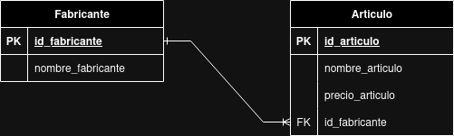
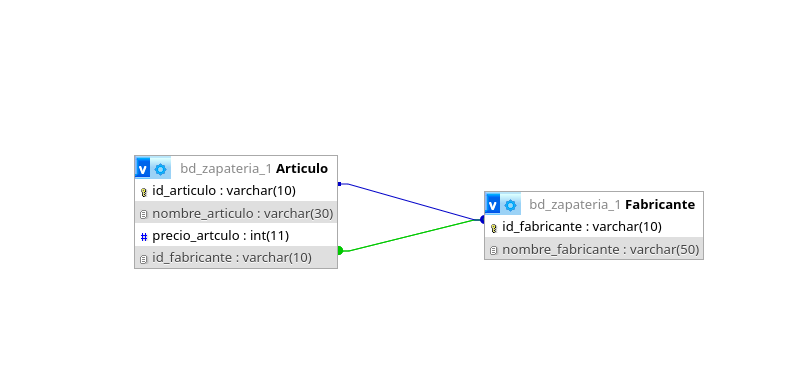

# bd_zapateria base de datos para una zapateria

## Modelo Entidad-Relacion

## Modelo Fisico de la BD

## tabla fabricante

## tabla articulo

## consultas a la bd

1. Mostrar la lista de todos datos de los fabricantes

`SELECT * FROM fabricante;`

2. Mostrar la lista de nombres de los fabricantes 

`SELECT nombre_fabricante AS fabricante FROM fabricante;`

3. Mostrar los nombres de los productos.

`SELECT nombre_articulo FROM * articulo`

4. mostrar los precios de los nombres de los productos

`SELECT nombre_articulo AS Nombre, precio_articulo AS Precio FROM Articulo;`

5. Obtener los nombres de los articulos cuyos precios sean mayor a 50000

`SELECT nombre_articulo FROM Articulo WHERE precio_articulo > 50000;`

6. Obtener el nombre de los articulos cuyo precio este entre 5000 y 40000 ambos incluidos 

## Forma 1
`SELECT nombre_articulo FROM Articulo WHERE precio_articulo >= 5000 AND precio_articulo <= 40000;`

## Forma 2
`SELECT nombre_articulo FROM Articulo WHERE precio_articulo BETWEEN 5000 AND 40000;`

7. obtener el nombre y el precio en dolares
`SELECT nombre_articulo FROM Articulo WHERE precio_articulo >= 50000`

8. obtener el precio promedio de los articulos

9. obteber el precio promedio de los articulos cuyo id sean fab02

10. obtener el numero de los articulos cuyo precio sea mayor o igual a 50000

